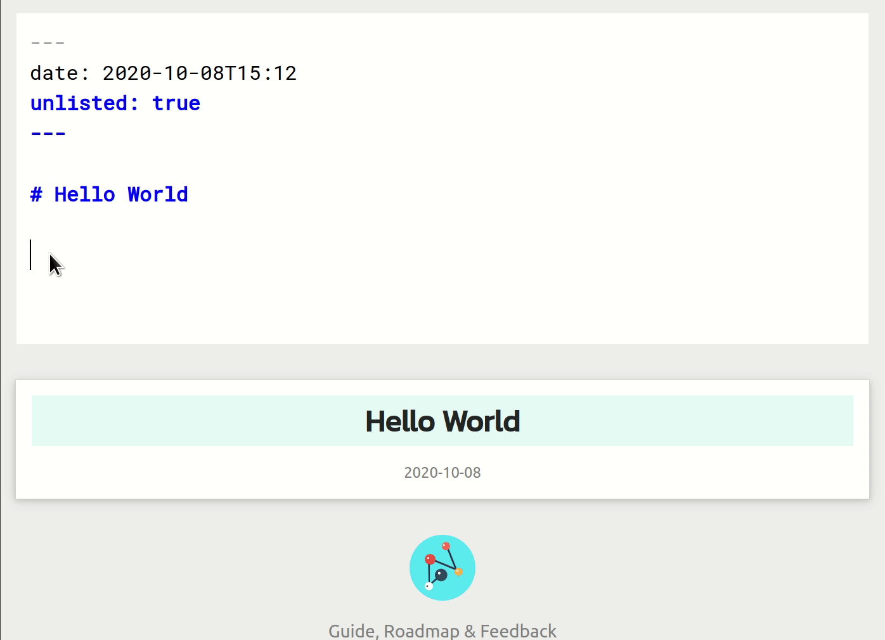
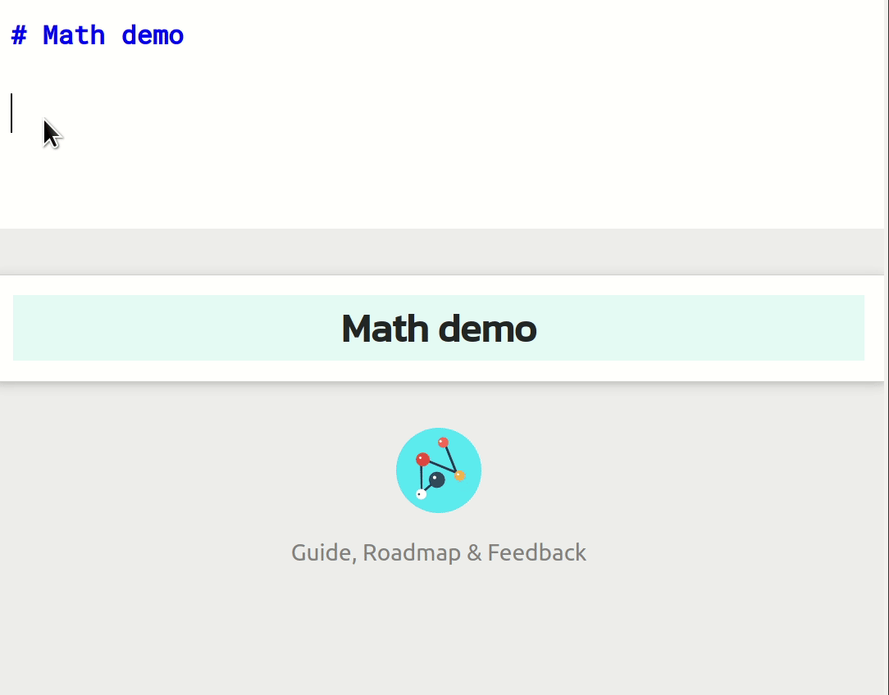

# Neuron 1.0 released

[[neuron]] ([GitHub repo](https://github.com/srid/neuron)) is a note-taking tool based on [Zettelkasten](https://neuron.zettel.page/zettelkasten.html), that aims to be [future-proof](https://neuron.zettel.page/philosophy.html), and is optimized for publishing on the web. Version [1.0](https://github.com/srid/neuron/releases/tag/1.0.0.0) just got released, with better linking support and many other improvements.

## Better Linking

Neuron now supports **wiki-links**, the same syntax used by other software like Zettlr and Obsidian. If your note file is named "neuron-v1.md", you can link to it using `[[neuron-v1]]`. **Regular Markdown links** also now works as they should -- for example, `[Neuron v1.0 released](neuron-v1.md)` works exactly like the wiki-link syntax in that it will be recognized as a Zettelkasten connection.

Finally, neuron allows **arbitrary title** in the note filename. For example, you can start writing a note saved in the file `Neuron v1.0 released.md`, and link to it from other notes as `[[Neuron v1.0 released]]`. This is called a [title ID](https://neuron.zettel.page/id.html). The title of the note is automatically inferred from this filename, unless of course you explicitly specify one in the body of the note (which title ID obviates).

## Git-like CLI

Previous versions of neuron required you to pass an explicit `-d` argument when working on multiple notebooks. This is now obviated by adopting a Git-like CLI interface, wherein neuron will treat the current directory as your notebook without a `-d` argument.

## Static binaries

Some users do not wish to install Nix, and they [requested static binaries](https://github.com/srid/neuron/issues/183). We now have a static binary[^nix] for neuron, albeit only for Linux.

[^nix]: The static binaries are built using Nix itself; see [[db359075]].

## Other improvements

Other notable changes include:

- **Inline tags**: You can inline your tags in your notes, so writing `#foo` will automatically tag the note with "foo".
- **Better unicode support**: Now filenames are also unicode-aware. You can write in `计算机.md` and then link to it as `[[计算机]]`.
- **Custom JavaScript**: Insert custom JavaScript or head HTML in generated site by adding a `head.html` file to your notebook. Users use this to do anything from using a different Math library (KaTeX) to [adding a navigation bar](https://truong.io/notes/).
- **All backlinks**: Backlinks panel now shows all backlinks (including folgezettel)
- .. and more

See [the release notes](https://github.com/srid/neuron/releases/tag/1.0.0.0) for a full list of changes.

## Cerveau

[Cerveau](https://www.cerveau.app), the web app for neuron, is now officially out of public beta. Since the public beta (announced at [[689c4a39]]), the following improvements were made:

1. **MathJax Live Preview** (see below)
2. **WikiLink autocomplete** (see above)
3. Tag pages
4. Other UX improvements

## Future of neuron

Now that version 1.0 is released, I see  two major focus-areas for future-proof open source note-taking -- performance & extensibility. **Performance** is important for especially large Zettelkastens (think - over 50000 notes), and **extensibility** enables us to keep neuron's core small and simple, while allowing users to enrich their notebook with interesting features (eg: flash cards, task management, [self-tracking](https://www.gibney.de/a_syntax_for_self-tracking), [Pandoc filters](https://github.com/srid/neuron/issues/228#issuecomment-670290253)) without complicating neuron itself.

To achieve this, I'm working on a new (independent) core for neuron, called [[ka]] (named after [the Egyptian concept][ka-name]) that eventually will supplant rib/shake used currently in neuron. `ka` uses Functional Reactive Programming to provide a reactive build pipeline[^ghcide] specifically geared towards note-taking, as well as plugin mechanism to customize the behaviour of the application at various stages.

[ka-name]: https://en.wikipedia.org/w/index.php?title=Ancient_Egyptian_conception_of_the_soul&oldid=972528324#Ka_(vital_essence)

---

:::{.ui .message .segment}
Special thanks goes to the recent [sponsors][sponsor], including
 [Chris Gwilliams](https://github.com/encima),
 [Edward Liaw](https://github.com/edliaw),
 [Joel McCracken](https://github.com/joelmccracken),
 [Alessandro Marrella](https://github.com/amarrella),
 [Randolph Kahle](https://github.com/RandolphKahle),
 [Sudeep](https://github.com/sudeepdino008),
 [Eric Moritz](https://github.com/ericmoritz).

💖
:::

If you enjoy using neuron and/or Cerveau, and would like to show your appreciation, you might be interested in the [GitHub sponsor][sponsor] goal that will enable the eventual open-sourcing of [Cerveau][cerveau], a full-stack [[2012405]] app.

[sponsor]: https://github.com/sponsors/srid
[cerveau]: https://www.cerveau.app

[^ghcide]: See [this blog post](https://mpickering.github.io/posts/2020-03-16-ghcide-reflex.html) which details using [[2012405]] as build engine in ghcide.
